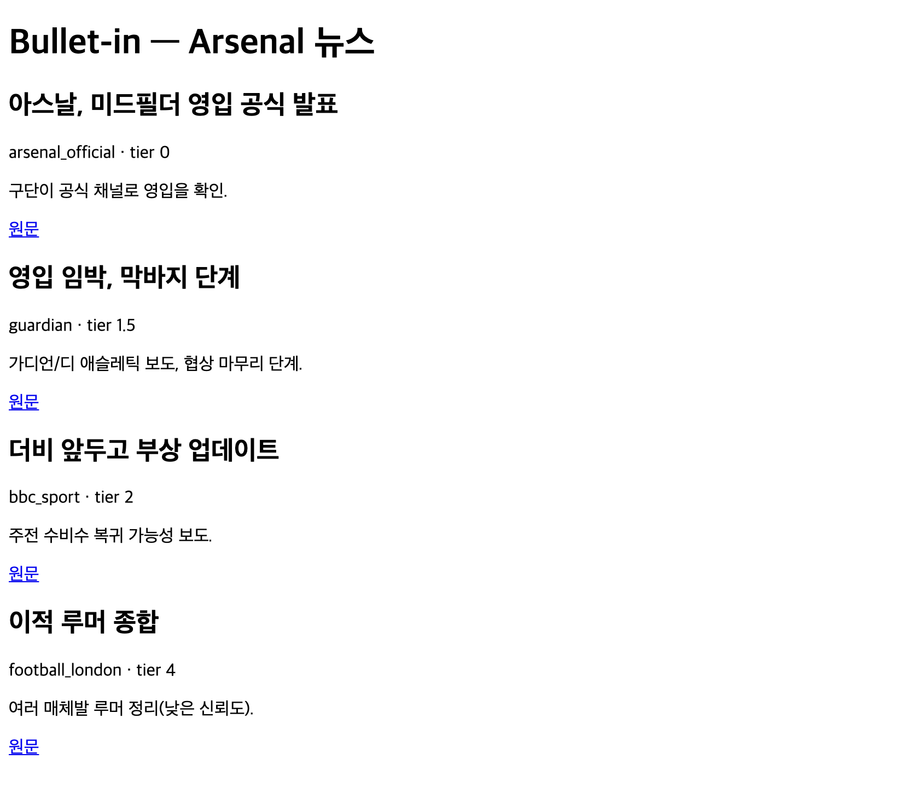
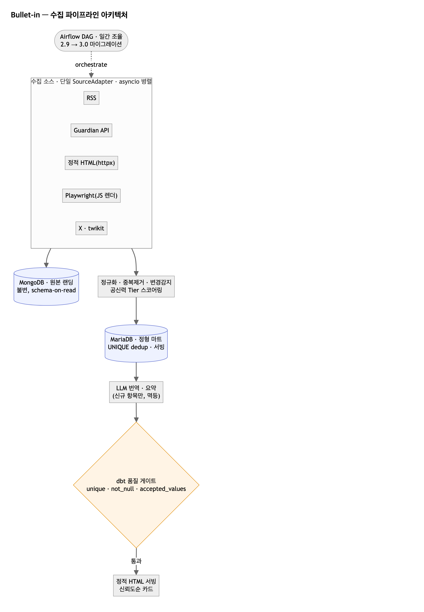

# Bullet-in

> 영국 현지 언론·ITK(X)의 Arsenal FC 소식을 매일 병렬 수집하고, 공신력으로 스코어링·중복제거한 뒤 LLM으로 번역·요약하여 신뢰도순으로 보여주는 뉴스 수집 파이프라인.

*Bullet-in = bulletin(단신) + bullet(병기고 Arsenal)의 언어유희.*



> 샘플 데이터로 렌더한 v1 뷰(스타일 미적용). 신뢰도(tier) 순 정렬 + 한국어 번역·요약.
<!-- 라이브 e2e 후 실데이터 화면 캡처 → docs/assets/serving-page-live.png 저장 후 아래 주석 해제 -->
<!--  -->

---

## 1. 동기

아스날 뉴스는 영국 현지 언론과 ITK(In The Know) 트위터에 흩어져 있고, 매체·계정마다 공신력 편차가 크다. 신뢰할 만한 소스만 골라 한곳에서, 한국어로 번역·요약해 신뢰도순으로 보고 싶다는 필요에서 출발했다. **영국 현지 소스를 한곳에 모아 공신력순으로 정렬하고 한국어로 번역·요약**하는 개인용 서비스다.

단순 "긁어서 저장" 스크립트가 아니라, 신뢰성·멱등성·데이터 품질·관측성을 갖춘 **데이터 프로덕트**로 설계했다.

## 2. 아키텍처

메달리온(Bronze→Silver/Gold) + AI 인리치먼트 파이프라인.



```
[Ingest]    소스별 어댑터 (RSS · Guardian API · httpx+파서 · Playwright · twikit)
   │        단일 SourceAdapter 인터페이스 / asyncio 팬아웃 병렬
   ▼
[Normalize] pydantic 정규화
   ▼
[Dedup]     URL 정규화 + content_hash, 증분, 변경 감지
   ▼
[Score]     공신력 Tier(0~4) → confidence (YAML 설정)
   ▼
[Load raw]  MongoDB (불변 원문, schema-on-read)
   ▼
[Load mart] MariaDB (정형 mart, UNIQUE dedup, 서빙)
   ▼
[Enrich]    LLM 번역(한국어) + 요약 (신규 항목만, 멱등)
   ▼
[Quality]   dbt(DuckDB가 MariaDB attach) build + test = 품질 게이트
   ▼ (통과 시)
[Serve]     신뢰도순 정적 HTML

오케스트레이션: Airflow (2.9 구축 → 3.0 마이그레이션) 가 전 단계를 일간 조율
```

## 3. 핵심 기능

- **이종 소스 통합** — RSS·REST API·정적 HTML·JS 렌더링·X(트위터)를 단일 어댑터 인터페이스 뒤로. 소스별 최적 도구 선택(정적=httpx, API=Guardian, 동적=Playwright, X=twikit).
- **병렬 수집** — asyncio 팬아웃 + 소스별 실패 격리(한 소스 실패가 전체를 멈추지 않음).
- **공신력 스코어링** — Tier 0(Arsenal.com 공식)~4(타블로이드)를 YAML로 외부화, confidence로 정렬.
- **중복제거·증분·변경 감지** — content_hash + URL 정규화, DB UNIQUE 제약으로 앱·DB 이중 방어.
- **LLM 번역·요약** — Gemini 2.5 Flash-Lite로 한국어 번역·한 줄 요약. 신규 항목만 처리해 멱등·저비용.
- **데이터 품질 게이트** — dbt test(unique·not_null·accepted_values·freshness)로 "이상 점검"을 선언적으로.

## 4. 정량 지표 (SLO)

> 목표치와 측정 방법. 실측값은 라이브 e2e 실행 후 채운다.

| 지표 | 목표 | 측정 방법 |
|---|---|---|
| 병렬화 수집 시간 단축 | 순차 대비 ~70%↓ | `metrics.benchmark()` (concurrency=1 vs N 벤치마크) |
| 중복 적재율 | 0% | content_hash UNIQUE + dbt `unique` 테스트 |
| 일일 수집 성공률 | ≥ 99% | `pipeline_runs.success_rate` (재시도·소스 격리 포함) |
| 필수 필드 완전성 | ≥ 99% | dbt `not_null` 테스트 통과율 |
| 수집량 이상 감지 | 전일 대비 ±2σ 알림 | `quality.volume_anomaly` |

## 5. 기술 스택 & 선택 이유

| 영역 | 선택 | 이유 |
|---|---|---|
| 서빙 mart | **MariaDB** | 일 수십~수백 건 서빙(포인트 조회·필터·UNIQUE dedup)에 OLTP가 최적 |
| 원본 랜딩 | **MongoDB** | 이종 원문을 손실 없이 schema-on-read로 보존 → 재처리 가능 |
| 품질/분석 | **dbt + DuckDB** | dbt test가 "이상 점검"과 정면 일치, DuckDB가 MariaDB attach해 zero-infra 분석 |
| 스크래핑 | **Playwright/httpx/twikit** | 소스 난이도(정적~인증·안티봇)에 맞는 도구 선택 |
| 오케스트레이션 | **Airflow 3.0** | 일간 DAG. 2.9→3.0 마이그레이션 직접 수행 ([docs/MIGRATION.md](docs/MIGRATION.md)) |
| LLM 번역·요약 | **Gemini 2.5 Flash-Lite** | 일 수백 건 저용량·단순 번역에 최적. [무료 티어](https://ai.google.dev/gemini-api/docs/pricing)로 비용 0, 유료도 1M 토큰당 입력 $0.10·출력 $0.40. `response_mime_type`으로 JSON 출력 유도 |

**왜 CDC를 안 썼나** — CDC(Debezium/binlog)는 상류 트랜잭션 DB의 변경을 캡처하는 기술인데, 본 파이프라인의 소스는 웹/API/X라 읽을 binlog가 없다. 일 수백 건 배치에 Kafka+Debezium은 과설계이므로, **앱 레벨 변경 감지(content_hash 비교 + revision)**로 뉴스 수정·삭제에 대응했다.

## 6. 데이터 모델

- **MongoDB `raw_items`** (Bronze): 원문 불변 보존.
- **MariaDB `articles`** (Silver/Gold): 정규화 메타 + tier + confidence + 번역/요약. `content_hash`·`url` UNIQUE로 dedup.
- **MariaDB `pipeline_runs`**: 런별 SLO 근거(성공률·소요시간·신규/에러 건수).
- **dbt 마트**: `daily_source_quality` 등 분석/품질 롤업.

## 7. 실행 방법

```bash
# 0. 환경
cp .env.example .env          # 값 채우기 (Mongo/MariaDB/Gemini/Guardian/X)
uv sync --extra dev
uv run playwright install chromium

# 1. 데이터 스토어
docker compose up -d          # mongo, mariadb

# 2. 파이프라인 실행
uv run python -m bullet_in.run --concurrency 8

# 3. 품질 게이트
cd dbt && uv run dbt build --profiles-dir .

# 4. 결과 확인
open site/index.html
```

테스트: `uv run pytest -q` (단위/통합), Airflow DAG 임포트는 별도 venv에서 검증([docs/MIGRATION.md](docs/MIGRATION.md)).

운영 절차는 [docs/runbook/](docs/runbook/), 트러블슈팅 기록은 [docs/troubleshooting/](docs/troubleshooting/).

## 8. 한계 & 향후

- 현재는 얇은 정적 뷰. 향후: 모니터링 대시보드, 사용자 구독/필터, AWS 배포.
- 소스 확장(The Athletic 등 하드 페이월, 추가 ITK)은 어댑터 추가로 대응.
- 교차 corroboration 스코어링(다수 소스 보도 시 신뢰도↑), 번역 정확도 스팟체크는 stretch.

## 9. 윤리 & 법적 고지

- 공개 콘텐츠 대상, robots.txt 준수, 보수적 rate limit, 출처/링크 표기.
- X(ITK)는 ToS 그레이존 → 버너 계정 사용, 자격증명은 `.env`로 분리(커밋 금지), 개인 학습 용도.
- 원문 전체 재배포가 아니라 메타데이터·요약·원문 링크 중심으로 서빙.
