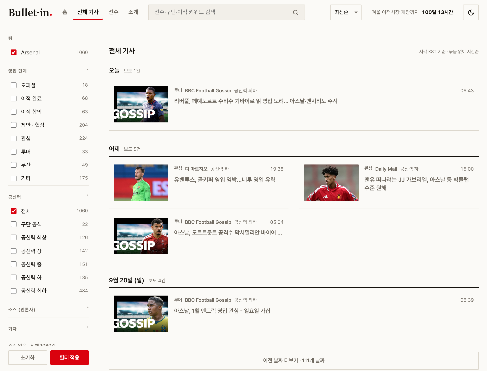
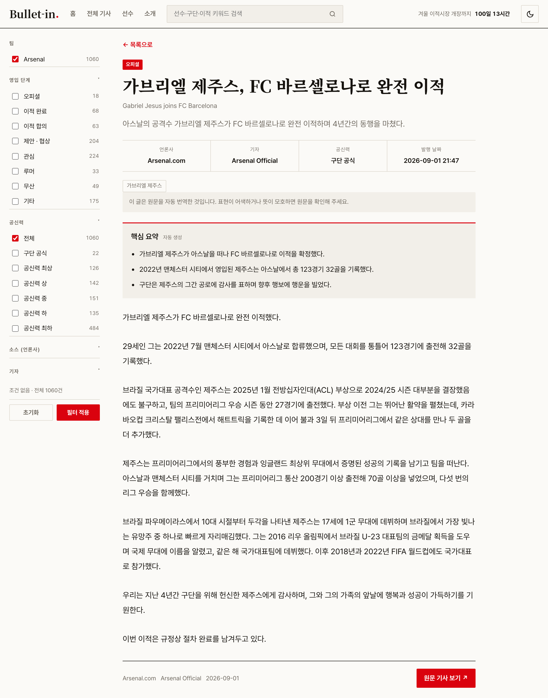
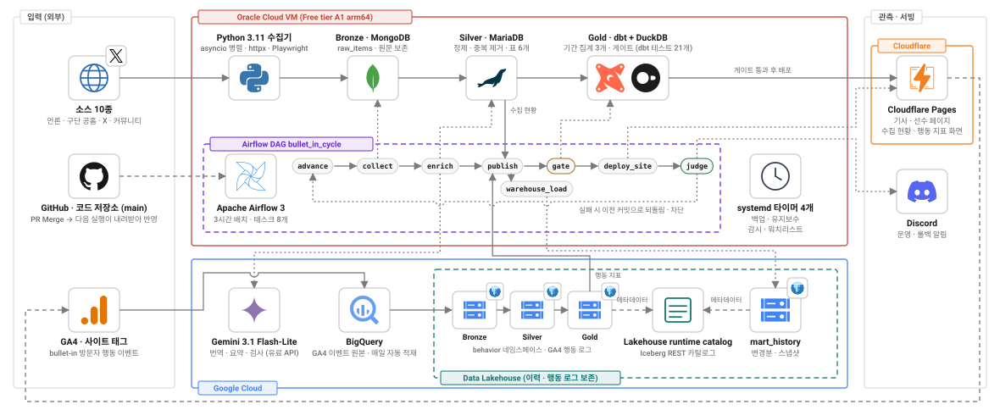
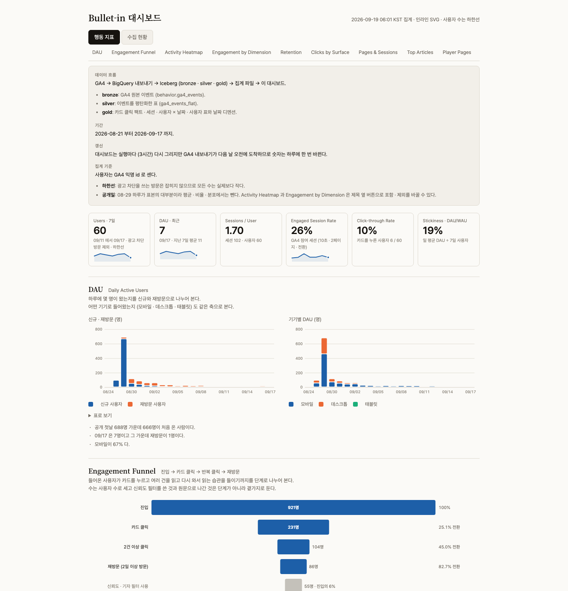
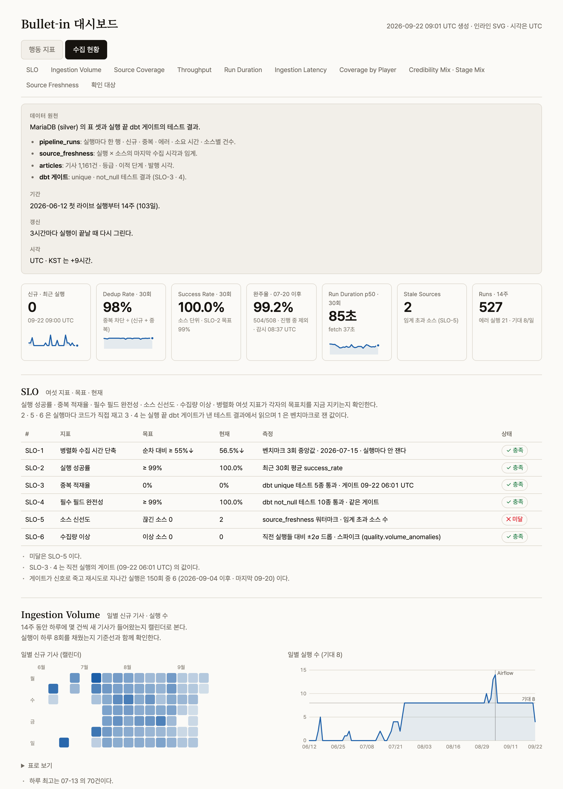

# Bullet-in

[](https://github.com/benidjor/bullet-in/actions/workflows/ci.yml)

> 영국 현지 언론 · ITK (X) 의 Arsenal FC 소식을 하루 8회 병렬 수집하고 공신력으로 스코어링 · 중복 제거한 뒤 LLM 으로 번역 · 요약해 신뢰도순으로 보여주는 뉴스 수집 파이프라인.
>
> **공개 서비스**: https://bullet-in.pages.dev — 2026-08-29 공개 · Airflow 회차가 3시간마다 수집 · 검사 · 배포한다. 지금 살아 있는지는 [수집 현황 화면](https://bullet-in.pages.dev/ops.html) 의 「생성」 시각과 SLO 표가 말해 준다.

*Bullet-in = bulletin (단신) + bullet (병기고 Arsenal) 의 언어유희.*



> 전체 기사 화면 (`all.html`). 날짜별 시간순 · 영입 단계 · 공신력 · 소스 · 기자 facet 필터 · 한국어 번역 · 요약. 홈은 대표 기사와 주요 소식을 신문처럼 배치한다.



> 기사 상세. 3줄 요약 · 소스별 차등 서빙 (언론사 = 발췌 + 원문 링크, X · 공식 = 전문) · 기자 바이라인.

---

## 1. 동기

아스날 뉴스는 영국 현지 언론과 ITK (In The Know) 트위터에 흩어져 있고 매체 · 계정마다 공신력 편차가 크다. 신뢰할 만한 소스만 골라 한곳에서, 한국어로 번역 · 요약해 신뢰도순으로 보고 싶다는 필요에서 출발했다. **영국 현지 소스를 한곳에 모아 공신력순으로 정렬하고 한국어로 번역 · 요약**하는 서비스다.

단순 「긁어서 저장」 스크립트가 아니라 신뢰성 · 멱등성 · 데이터 품질 · 관측성을 갖춘 **데이터 프로덕트**로 설계했고 공개 첫 주에 실제 독자 890명 (7일 · 광고 차단 방문은 안 잡히므로 하한선) 이 다녀갔다.

## 2. 아키텍처

메달리온 (Bronze → Silver → Gold) + LLM 인리치먼트 + 품질 게이트 + 배포 자동화. 회차 하나가 Airflow DAG 의 태스크 여덟으로 돈다.



```
Airflow DAG bullet_in_cycle (3시간 간격 · LocalExecutor · 태스크 여덟)

advance ─▶ collect ─▶ enrich ─▶ publish ─▶ gate ─▶ deploy_site ─▶ judge
                                   └─▶ warehouse_load (publish 뒤 병렬)

advance         origin/main 을 내려받는다 (세션이 VM 에서 git pull 을 하지 않는다)
collect         소스 어댑터 아홉을 asyncio 로 병렬 수집 → 정규화 → URL · content_hash 로 중복 제거 → 공신력 tier → MongoDB (Bronze) · MariaDB (Silver)
enrich          Gemini 로 번역 · 요약 · 영입 단계 분류 (신규 행만 · 멱등)
publish         정적 HTML 렌더 (기사 · 선수 · 대시보드 두 화면) + 회차 기록 · 신선도 판정
gate            dbt build + test 21종 (DuckDB 가 MariaDB attach) — 실패면 배포를 세운다
deploy_site     Cloudflare Pages 업로드 (산출물이 비정상이면 중단)
judge           라이브의 build.json 으로 반영을 확인 · 실패면 이전 커밋으로 롤백 · Discord 알림
warehouse_load  MariaDB 변경분 · 스냅샷과 GA4 행동 로그를 Iceberg (GCS) 에 적재 · gold 표 재작성
```

systemd 는 회차 밖의 부수 작업만 맡는다 — 선수 워치리스트 (귀속 선수를 fmkorea 에서 돌려 검색) · 매일 백업 (GCS) · 레이크하우스 유지보수 (스냅샷 만료 · 컴팩션) · Airflow 감시 (심박 · 회차 지연).

## 3. 핵심 기능

- **이종 소스 통합** — RSS · REST API · 정적 HTML · JS 렌더링 · X (트위터) · 한국 커뮤니티를 단일 어댑터 인터페이스 뒤로. 소스별 최적 도구 선택 (정적 = httpx, API = Guardian, X = 쿠키 주입 Playwright).
- **병렬 수집 · 실패 격리** — asyncio 팬아웃. 한 소스의 실패가 회차를 멈추지 않는다.
- **공신력 스코어링** — Tier 0 (Arsenal.com 공식) 에서 4 (타블로이드) 를 YAML 로 외부화, confidence 로 정렬. 기자 단위 tier 가 매체 tier 를 덮는다 (전담 기자의 기사만 승격).
- **중복 제거 · 증분 · 변경 감지** — content_hash + URL 정규화, DB UNIQUE 제약으로 앱 · DB 이중 방어.
- **LLM 번역 · 요약** — Gemini 2.5 Flash-Lite 로 제목 · 본문 번역, 한 줄 · 3줄 요약, 영입 단계 분류. 신규 행만 처리해 멱등. 429 를 만나면 그 회차를 멈추고 다음 회차가 잇는다.
- **선수 축** — 기사에서 선수를 추출해 주체 · 언급으로 귀속하고 선수별 페이지와 이적 상태 (영입 진행 · 확정 · 무산 · 타 클럽행 · 방출) 를 명단에서 관리한다.
- **데이터 품질 게이트** — 회차 끝 dbt test 21종이 배포를 막는다 (§6).
- **배포 자동화** — 머지된 코드를 다음 회차가 스스로 받고 반영을 라이브에서 확인하고 실패면 되돌린다 (§5).
- **관측성** — 대시보드 두 화면 (행동 지표 · 수집 현황) 과 Discord 알림 (수집량 이상 · 신선도 · 게이트 · 태스크 실패 · 배포 판정).
- **행동 로그 · 레이크하우스** — GA4 이벤트를 Iceberg 에 bronze · silver · gold 로 쌓고 (사람 · 세션 · 코호트 표), 마트의 변경 이력과 일별 스냅샷도 같은 레이크하우스에 남긴다 (§8).

**수집 소스** — 고정 tier 7종 + 항목별 동적 tier 2종 (X · 커뮤니티는 언급된 기자 · 매체의 공신력으로 산출). 언론 5종은 공통 이적 키워드 필터를 공유한다 (`config/sources.yaml`).

| 소스 | tier | 어댑터 | 비고 |
|---|---|---|---|
| Arsenal.com | 0 | arsenal_api | 공식 — 공홈 GraphQL API, taxonomy 필터 (이적 · 1군 재계약) |
| BBC Sport | 1.5 | html | 비전담 기준선 — 전담 (Mokbel) 은 tier 1 승격 |
| Sky Sports | 2 | html | 비전담 기준선 — 전담 (Sheth) 은 tier 1.5 승격 |
| The Guardian | 3 | guardian_api | Open Platform API (`GUARDIAN_API_KEY` 필요) |
| Goal.com | 4 | html | 정적 서빙 확인으로 playwright → html 전환 (2026-07) |
| BBC Football Gossip | 4 | html | 타 매체 루머 라운드업 |
| football.london | 4 | html | 2026-07 이후 비활성 (`enabled: false`) · 옛 회차 기록에는 남아 있다 |
| afcstuff (X) | 동적 | x_playwright | 트윗 내 언급 기자 · 매체 tier 로 라우팅 (fallback 4) |
| David Ornstein (X) | 1 | x_playwright | 기자 본인 계정 — 트윗에 @핸들이 없어 고정 tier |
| fmkorea 축구 소식통 | 동적 | fmkorea | 한국 커뮤니티 — 언급 기자 · 매체 tier 로 라우팅 (기본 4) |

**기자 · ITK 공신력** — 동적 소스 항목의 tier 산출 기준 (기자 먼저 → 매체 → 기본 4). 레지스트리 전체 (기자 · ITK 105명 · 매체 55곳 · 별칭) 는 [`config/credibility.yaml`](config/credibility.yaml) 에 있고 화면의 기자 필터가 같은 파일을 읽는다.

## 4. 정량 지표 (SLO)

> 목표치와 측정 방법. 번호는 [수집 현황 화면](https://bullet-in.pages.dev/ops.html) 의 SLO 표와 같고 SLO-2 에서 6 은 회차마다 그 화면에 다시 적힌다. 병렬화 실측 절차는 [SLO-1 벤치마크 런북](docs/runbook/2026-07-14-slo1-benchmark.md), 측정 방법의 정의는 [SLO 측정 런북](docs/runbook/2026-07-19-slo-measurement.md).

| 번호 | 지표 | 목표 | 측정 방법 | 실측 (2026-09-05) |
|---|---|---|---|---|
| SLO-1 | 병렬화 수집 시간 단축 | 순차 대비 ≥ 55%↓ (실측 기반 재조정¹) | `metrics.benchmark()` (concurrency=1 vs N 벤치마크) | 56.5%↓ (2026-07-15, 3회 중앙값 · 회차마다 안 잰다) |
| SLO-2 | 회차 성공률 | ≥ 99% | `pipeline_runs.success_rate` 최근 30회 평균 (재시도 · 소스 격리 포함) | 99.6% |
| SLO-3 | 중복 적재율 | 0% | content_hash · URL UNIQUE + dbt `unique` 테스트 5종 | 0% (기사 1,045건) |
| SLO-4 | 필수 필드 완전성 | ≥ 99% | dbt `not_null` 테스트 10종 | 100% |
| SLO-5 | 소스 신선도 | 끊긴 소스 0 | `source_freshness` 워터마크 · 소스별 임계 (24h 에서 192h) 초과 여부 | 0 |
| SLO-6 | 수집량 이상 감지 | 이상 소스 0 · ±2σ 알림 | `quality.volume_anomalies` (직전 회차들 대비) | 0 · 가동 (실발송 검증 2026-07-13) |

¹ 초기 목표 ~70% 는 최장 소스 (x_afcstuff, Playwright ~42s) 가 병렬 시간의 하한을 결정하는 구조로 도달 불가 실측 — 사유 · 산식은 런북 §5.

## 5. 운영

회차 · 배포 · 감시가 사람 손 없이 돈다. 2026-09-04 에 systemd 타이머에서 Airflow DAG 로 옮겼고 첫 24시간 정규 8회가 전부 성공했다 (3.5분에서 6.0분 · 재시도 0 · 오경보 0 — [런북 §6.5](docs/runbook/2026-09-04-running-the-cycle-under-airflow.md)).

- **회차** — Airflow 3.3.1 · LocalExecutor · Postgres 메타 DB · DAG 하나 · 태스크 여덟 (§2). `catchup=False` · `max_active_runs=1` · `dagrun_timeout` 30분으로 옛 타이머의 성질 (밀린 회차는 한 번 · 이중 실행 금지) 을 그대로 옮겼다.
- **배포 자동화** — `advance` 가 `origin/main` 을 내려받고 회차가 돈 뒤 `judge` 가 라이브의 `build.json` 으로 반영을 확인한다. 게이트 실패 · 배포 실패 · 반영 불일치면 이전 커밋으로 되돌리고 Discord 리뷰 채널에 알린다. 설계는 [배포 자동화 스펙](docs/superpowers/specs/2026-09-03-deploy-automation-design.md).
- **알림** — Discord 채널 둘 (사고 · 리뷰). 수집량 이상 · 소스 신선도 · dbt 게이트 차단 · 태스크 실패 · DAG 시간 초과 · 배포 판정 · 워치리스트 · 명단 정합. 알림은 「무엇이 · 어디서 · 다음에 볼 로그」 를 한 장에 싣는다.
- **백업** — 매일 MariaDB 논리 덤프와 MongoDB 아카이브 (합쳐 약 4 MB) 를 GCS 로. 복구는 되살려 본 절차만 적는다 ([백업 · 복구 런북](docs/runbook/2026-09-01-backup-and-restore.md)).
- **대시보드 두 화면** — 정적 HTML 이고 회차마다 다시 그린다. 검색 엔진에는 싣지 않는다.



> [행동 지표](https://bullet-in.pages.dev/behavior.html) — DAU · 퍼널 (진입 → 카드 클릭 → 반복 → 재방문) · 요일 × 시각 히트맵 · 관심 지수 · 리텐션 · 화면별 클릭 · 페이지 · 상위 기사 · 선수 페이지. GA4 → Iceberg gold 표에서 집계한다.



> [수집 현황](https://bullet-in.pages.dev/ops.html) — SLO 여섯 행 · 일별 신규 · 회차 수 캘린더 · 소스 × 주 · 처리량 · 소요 밴드 · 발행 → 수집 지연 · 선수 축 · 공신력 · 단계 구성 · 소스 신선도. MariaDB 와 직전 회차 게이트 결과 파일에서 그린다.

## 6. 데이터 품질

품질 검사는 「이상 점검」 을 선언하고 통과하지 못하면 배포를 세운다.

- **dbt 게이트** — 회차의 `gate` 태스크가 `dbt build` 로 스테이징 다섯 · gold 셋을 만들고 테스트 21종 (unique 5 · not_null 10 · accepted_values 4 · relationships 2) 을 돈다. 차단이면 `deploy_site` 가 돌지 않고 알림이 나간다. 경고 (임계 아래 결측) 는 저널에 남긴다. 설계는 [dbt 품질 게이트 스펙](docs/superpowers/specs/2026-08-31-dbt-quality-gate-design.md).
- **게이트 자체의 고장** — dbt 가 신호로 죽으면 (세그폴트) 한 번 더 돌리고 결과 파일이 없으면 통과로 읽지 않는다. 2026-08-31 에 실제로 막힌 뒤 진단을 stdout · stderr 둘 다 싣게 고쳤다 ([트러블슈팅](docs/troubleshooting/2026-09-01-the-gate-blocked-and-the-journal-could-not-say-why.md)).
- **신선도** — 소스마다 마지막 수집 시각을 원본 수집 워터마크로 판정한다. 임계는 소스마다 다르고 (24h 에서 192h) 실측 공백 분포로 정했다. 초과하면 알림, 재알림은 48시간 간격.
- **수집량 이상** — 직전 회차들의 소스별 건수 대비 ±2σ 드롭 · 스파이크를 회차마다 본다.
- **번역 품질** — 재작성 잔존율 (원문 문장이 그대로 남은 비율) 이 임계를 넘은 기사를 수집 현황 화면에 올린다. 사람이 본다.
- **테스트** — 1,772 (단위 · 통합 · DAG 임포트). 통합 테스트는 CI 의 MariaDB 컨테이너에 실제로 붙는다.

## 7. 기술 스택 & 선택 이유

| 영역 | 선택 | 이유 |
|---|---|---|
| 서빙 mart | **MariaDB** | 일 수십 건 서빙 (포인트 조회 · 필터 · UNIQUE dedup) 에 OLTP 가 최적 |
| 원본 랜딩 | **MongoDB** | 이종 원문을 손실 없이 schema-on-read 로 보존 → 재처리 가능 |
| 품질 · 분석 | **dbt + DuckDB** | dbt test 가 「이상 점검」 과 정면 일치 · DuckDB 가 MariaDB 를 attach 해 별도 인프라 없이 |
| 레이크하우스 | **Apache Iceberg on GCS + Google Lakehouse runtime catalog** | 변경 이력 · 스냅샷 · 행동 로그처럼 쌓이기만 하는 데이터를 서빙 DB 밖에 · pyiceberg 로 쓰고 카탈로그는 빌린다 (운영할 서버 없음) · 스냅샷 만료 7일 · 컴팩션 ([설계](docs/superpowers/specs/2026-09-02-history-lakehouse-design.md)) |
| 스크래핑 | **Playwright / httpx** | 소스 난이도 (정적에서 쿠키 인증 · 안티봇) 에 맞는 도구 선택 · X 는 쿠키 주입 Playwright |
| 스케줄 · 배포 | **Airflow 3 (LocalExecutor) + wrangler** | 회차를 태스크 여덟으로 쪼개 3시간마다 · 실패 태스크만 보이고 판정 태스크가 배포를 되돌린다 ([마이그레이션](docs/superpowers/specs/2026-09-04-airflow-migration-design.md)) · 회차 끝 Pages 직접 업로드 |
| LLM 번역 · 요약 | **Gemini 2.5 Flash-Lite** | 일 수백 건 저용량 · 단순 번역에 맞는 단가 · `response_mime_type` 으로 JSON 출력 유도. **유료 (Tier 1 선불)** 이고 월 요금은 GCP 결제 보고서에서 읽는다 — 문서에 금액을 적어 두면 낡는다 |

**왜 CDC 를 안 썼나** — CDC (Debezium · binlog) 는 상류 트랜잭션 DB 의 변경을 캡처하는 기술인데, 이 파이프라인의 소스는 웹 · API · X 라 읽을 binlog 가 없다. 일 수백 건 배치에 Kafka + Debezium 은 과설계이므로 **앱 레벨 변경 감지 (content_hash 비교 + revision)** 로 뉴스 수정 · 삭제에 대응했다. 변경 이력은 회차마다 Iceberg `articles_changes` 에 남는다.

## 8. 데이터 모델

메달리온 세 층이 서로 다른 저장소에 있다. 층 이름은 실물이 있는 자리에만 붙였다.

- **Bronze — MongoDB `raw_items`**: 원문 불변 보존. 신선도 판정의 워터마크가 여기서 나온다.
- **Silver — MariaDB 6표**: `articles` (정규화 메타 + tier + confidence + 번역 · 요약, `content_hash` · `url` UNIQUE 로 dedup) · `sources` · `players` · `article_players` (주체 · 언급) · `pipeline_runs` (회차별 SLO 근거) · `source_freshness` (회차 × 소스 신선도 이력).
- **Gold — dbt `models/gold/` 3모델**: `gold_daily_source_quality` · `gold_slo_rollup` · `gold_tier_distribution`. 회차 끝 `dbt build` 가 갱신하고 같은 실행의 테스트 21종이 품질 게이트다.

`models/staging/` 다섯은 MariaDB 표를 그대로 읽어 오는 통과 뷰라 층 이름을 안 붙였다.

**레이크하우스 (Iceberg on GCS)** — 서빙 DB 밖에 쌓이는 두 네임스페이스.

- `mart_history` — `articles_changes` (회차마다 변경분) · `articles_snapshot` · `players_snapshot` · `article_players_snapshot` (90일까지 매일 · 이후 주 1회) · `ops_daily`.
- `behavior` — GA4 이벤트의 bronze `ga4_events` · silver `ga4_events_flat` · gold `fact_card_click` · `dim_date` · `fact_session` · `fact_user_daily` · `dim_user`. gold 는 회차마다 silver 에서 통째로 다시 만든다. 사람을 세는 키는 `user_pseudo_id` 하나다 ([두 키를 섞으면 두 배로 센다](docs/troubleshooting/2026-09-04-two-keys-double-the-visitor-count.md)).

## 9. 실행 방법

```bash
# 0. 환경
cp .env.example .env          # 값 채우기 (Mongo · MariaDB · Gemini · Guardian · X)
uv sync --extra dev
uv run playwright install chromium

# 1. 데이터 스토어
docker compose up -d          # mongo, mariadb

# 2. 회차 한 번 (dotenv 미사용 → 셸 export 필요)
set -a; source .env; set +a
uv run python -m bullet_in.run --concurrency 8          # collect → enrich → publish → gate 를 한 프로세스로

# 3. 결과 확인
open site/index.html          # 기사 · 선수 · 대시보드 두 화면 (site/behavior.html · site/ops.html)
```

테스트는 `uv run pytest -q` (단위 · 통합 · 통합은 MariaDB 컨테이너가 없으면 skip). Airflow DAG 임포트는 별도 venv 에서 검증한다 ([docs/MIGRATION.md](docs/MIGRATION.md)). 운영 VM 의 회차 · 손 시작 · 되돌리기는 [Airflow 런북](docs/runbook/2026-09-04-running-the-cycle-under-airflow.md).

## 10. 문서 지도

설계 (`docs/superpowers/specs/` 71편) · 계획 (`docs/superpowers/plans/` 60편) · 런북 (`docs/runbook/` 84편) · 트러블슈팅 (`docs/troubleshooting/` 173편) 이 있다. 처음 읽을 다섯 편.

1. [회차를 Airflow 로 옮긴 설계](docs/superpowers/specs/2026-09-04-airflow-migration-design.md) — 왜 지금 옮겼나 · 태스크 여덟 · 실패의 세 갈래 (급사 · 건너뜀 · 차단) · 되돌리기.
2. [배포 자동화 설계](docs/superpowers/specs/2026-09-03-deploy-automation-design.md) — 머지된 코드가 스스로 배포되고 확인되고 되돌려지는 길.
3. [dbt 품질 게이트 설계](docs/superpowers/specs/2026-08-31-dbt-quality-gate-design.md) 와 [게이트가 막혔는데 저널이 이유를 못 말한 날](docs/troubleshooting/2026-09-01-the-gate-blocked-and-the-journal-could-not-say-why.md).
4. [백업 · 복구 런북](docs/runbook/2026-09-01-backup-and-restore.md) — 되살려 본 적 없는 백업은 백업이 아니다.
5. [두 키를 섞으면 방문자가 두 배로 센다](docs/troubleshooting/2026-09-04-two-keys-double-the-visitor-count.md) 와 [층을 잘못 본 차트 셋](docs/troubleshooting/2026-09-04-three-charts-that-pointed-at-the-wrong-layer.md) — 행동 로그를 화면에 올리기 전에 밟은 측정 함정.

트러블슈팅은 「무엇이 틀렸나」 보다 「어떤 잣대가 그것을 못 봤나」 를 적는다. 같은 잣대의 구멍이 다른 자리에서 되풀이되기 때문이다.

## 11. 한계 & 향후

- **재방문을 붙잡는 장치가 없다** — 공개 첫 주 진입 863명 가운데 카드를 누른 사람이 221명, 그 가운데 이틀 이상 다시 온 사람은 71명이다. 구독 · 알림 같은 장치는 아직 없다.
- **방문자 수는 하한선이다** — GA4 는 광고 차단 방문을 잡지 못한다. 화면과 이 문서의 사용자 수는 전부 실제보다 작다.
- **정적 서빙** — 페이지는 회차마다 다시 그린 HTML 이고 개인화 · 검색은 없다.
- **소스 확장** — The Athletic 같은 하드 페이월 · 추가 ITK 는 어댑터 추가로 대응한다. 교차 corroboration 스코어링 (다수 소스 보도 시 신뢰도↑) 과 번역 정확도 스팟체크는 stretch.
- **단일 VM** — 회차 · Airflow · DB 컨테이너가 한 VM 에 있다. 백업이 매일 나가지만 장애 시 복구는 사람이 런북대로 한다.

## 12. 윤리 & 법적 고지

- 공개 콘텐츠 대상, robots.txt 준수, 보수적 rate limit, 출처 · 링크 표기.
- X (ITK) 는 ToS 그레이존 → 버너 계정 사용, 자격증명은 `.env` 로 분리 (커밋 금지), 개인 학습 용도.
- 원문 전체 재배포가 아니라 메타데이터 · 요약 · 원문 링크 중심으로 서빙.
- 소스 성질에 비례한 차등 서빙 — 언론사 기사는 요약 + 짧은 발췌 + 원문 링크, 수십 단어 트윗과 구단 공식 발표문만 전문, 퍼가기 금지 커뮤니티는 헤드라인만.
- 방문 분석은 GA4 익명 id 만 쓰고 개인을 식별하지 않는다 ([이벤트 스키마](docs/superpowers/specs/2026-08-31-analytics-event-schema.md)).
