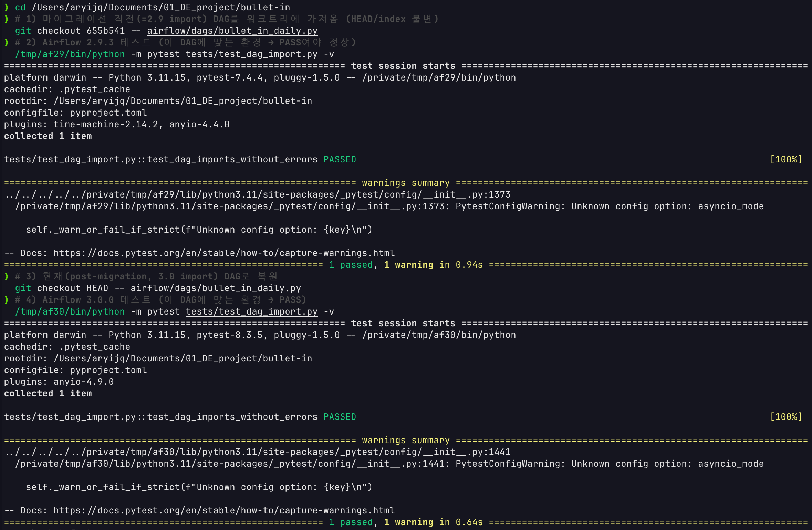

# 런북 — Airflow DAG 검증 (프로젝트 venv 오염 없이)

DAG 파싱(DagBag 임포트)을 프로젝트 환경과 **분리된 일회용 venv**에서 검증한다. Airflow는 의존성이 무겁고 핀이 빡빡해 프로젝트 deps(pydantic·httpx·playwright 등)와 충돌할 수 있으므로, 프로젝트 venv에는 설치하지 않는다.

## 왜 격리하나
- 프로젝트 venv엔 Airflow가 없어, `tests/test_dag_import.py`는 거기서 **정상 skip**된다(`importorskip("airflow.models")`). 이는 결함이 아니라 의도된 동작.
- 실제 검증은 Airflow만 설치한 격리 venv에서 한다. (프로젝트 deps와 한 환경에 섞으면 의존성 해석이 깨지기 쉽다.)
- DAG 파일은 `from bullet_in.run import main`을 **함수 안에서** import(지연)하므로, DagBag 파싱에는 Airflow + pendulum만 있으면 된다(프로젝트 설치 불필요).

## 절차 (2.9.3 / 3.0.0 각각)
```bash
# Airflow 2.9.3
uv venv /tmp/af29 --python 3.11
uv pip install --python /tmp/af29/bin/python --quiet "apache-airflow==2.9.3" pytest pendulum \
  --constraint "https://raw.githubusercontent.com/apache/airflow/constraints-2.9.3/constraints-3.11.txt"
/tmp/af29/bin/python -m pytest tests/test_dag_import.py -v

# Airflow 3.0.0
uv venv /tmp/af30 --python 3.11
uv pip install --python /tmp/af30/bin/python --quiet "apache-airflow==3.0.0" "apache-airflow-providers-standard" pytest pendulum \
  --constraint "https://raw.githubusercontent.com/apache/airflow/constraints-3.0.0/constraints-3.11.txt"
/tmp/af30/bin/python -m pytest tests/test_dag_import.py -v
```
기대: 각 venv에서 `test_dag_imports_without_errors` PASS — 단, **현재 DAG는 3.0 import 기준**이라 2.9 venv에서 그대로 돌리면 `ModuleNotFoundError`로 실패한다(=마이그레이션이 적용됐다는 증거). "양쪽 통과"를 사후에 재현하려면 아래 "마이그레이션 검증" 절차를 따른다.

## 마이그레이션 검증 (사후 재현)

마이그레이션 직전 DAG(2.9 import)를 워크트리에 임시로 가져와 2.9.3에서 통과시킨 뒤, 현재(post-migration, 3.0 import) DAG로 복원해 3.0.0에서 통과시킨다. HEAD/인덱스는 건드리지 않는다.

```bash
# 마이그레이션 직전 DAG로 임시 교체 (직전 커밋 SHA 자동 추출)
PREV=$(git log --format=%H -2 -- airflow/dags/bullet_in_daily.py | tail -1)
git checkout "$PREV" -- airflow/dags/bullet_in_daily.py

# 2.9.3 테스트
/tmp/af29/bin/python -m pytest tests/test_dag_import.py -v

# 현재(post-migration) DAG로 복원
git checkout HEAD -- airflow/dags/bullet_in_daily.py

# 3.0.0 테스트
/tmp/af30/bin/python -m pytest tests/test_dag_import.py -v
```
두 결과 모두 `1 passed`면 마이그레이션 검증 완료. 안전 확인: `git status -- airflow/dags/`가 비어 있어야 함.


<!-- (라이브) Airflow UI 캡처 → docs/assets/airflow-ui-dag-graph.png 저장 후 아래 주석 해제 -->
<!--  -->

## 정리
```bash
rm -rf /tmp/af29 /tmp/af30   # 일회용 venv 제거
```

## 비고 / 함정
- **공식 constraints 파일**을 반드시 쓴다. 안 쓰면 무거운 Airflow 의존성이 충돌·미해결로 설치 실패하기 쉽다.
- 3.0에서 `PythonOperator`는 `airflow.providers.standard.operators.python`로 이동했다 → `docs/MIGRATION.md`.
- 루트의 `airflow/` 디렉터리가 네임스페이스 패키지로 잡혀 importorskip이 오작동하는 함정은 `docs/troubleshooting/2026-05-27-airflow-namespace-shadowing.md` 참고.
