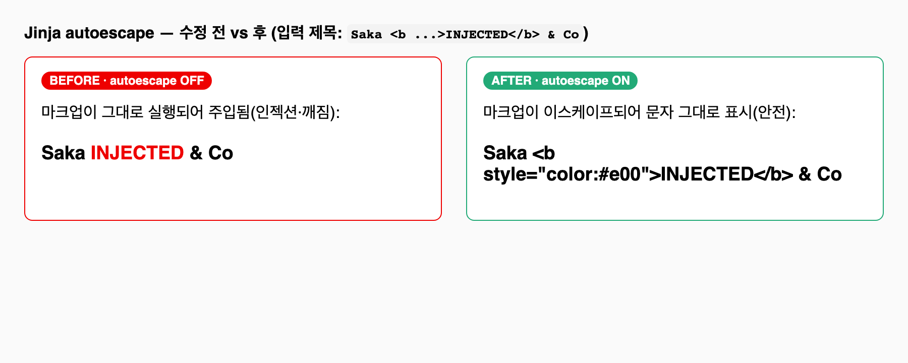

# Jinja2 autoescape가 `.j2` 확장자 때문에 꺼져 있던 문제

- **날짜**: 2026-05-27
- **영역**: serve
- **심각도**: 높음 (스크래핑 입력의 HTML 인젝션/렌더 깨짐)

## 증상
서빙 페이지(`site/index.html`) 렌더 시, 스크래핑한 기사 제목에 들어있는 `<`, `&`, `<script>` 같은 문자가 **이스케이프되지 않고 그대로** 출력된다. 제목에 특수문자가 있으면 레이아웃이 깨지고, 악의적 입력 시 스크립트 인젝션 위험.

예) 제목 `A & B <script>x</script>` → 출력에 `<script>x</script>`가 살아있음.

## 스크린샷 (수정 전/후)


왼쪽(BEFORE·autoescape OFF)은 마크업이 실행되어 빨간 `INJECTED`가 주입됨. 오른쪽(AFTER·autoescape ON)은 이스케이프되어 문자 그대로 표시(안전). 실제 Jinja2 동작으로 렌더한 비교.

## 진단 과정 (왜 이렇게 판단했는가)
1. **의심 지점**: 출력의 원천 데이터는 외부(스크래핑) 텍스트다. "Jinja autoescape가 켜져 있나?"를 먼저 의심.
2. **직접 입증**: 가정하지 않고 실제로 호출해 확인했다.
   ```python
   from jinja2 import select_autoescape
   select_autoescape(["html"])("index.html.j2")   # → False
   ```
   autoescape 함수가 우리 템플릿 이름에 대해 **False**를 돌려준다 = 이스케이프가 꺼져 있다.
3. **규칙 확인**: `select_autoescape(enabled_extensions=("html","htm","xml"))`는 **템플릿 파일명이 그 확장자로 끝날 때만** True. 우리 템플릿은 `index.html.j2`라 `.j2`로 끝나 매칭 실패. `default`는 기본 `False`라 결국 OFF.

## 원인
템플릿 파일명을 `index.html.j2`로 두면서 `select_autoescape(["html"])`를 썼다. 확장자 매칭이 `.j2`에 걸려 autoescape가 비활성. 단위 테스트는 한국어만 검사해 이 결함을 못 잡았다.

## 해결
확장자 매칭에 의존하지 않고 기본 이스케이프를 켠다.

```python
env = Environment(loader=FileSystemLoader(_TPL_DIR),
                  autoescape=select_autoescape(default_for_string=True, default=True))
```

(설치된 Jinja2에서 `default_for_string`/`default` 시그니처 유효함을 `inspect.signature`로 확인.) 회귀 테스트 추가:

```python
def test_render_escapes_scraped_html():
    html = render_page([{... "title_original": "A & B <script>x</script>" ...}])
    assert "<script>x</script>" not in html
    assert "&lt;script&gt;" in html
```

## 예방
- 외부/스크래핑 입력을 렌더하는 템플릿은 autoescape를 **명시적 `default=True`**로 두거나, 템플릿 확장자를 `.html`로 둔다.
- "autoescape가 켜져 있겠지"라고 가정하지 말고, 특수문자 입력으로 실제 출력을 검증하는 테스트를 둔다.
